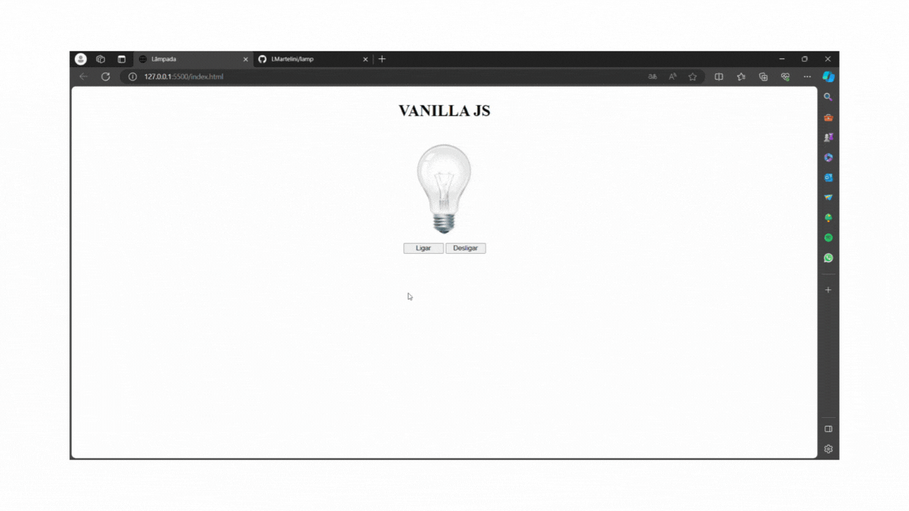

<h1 align="center">Lâmpada</h1>

<h5 align= "center">( lamp-nine.vercel.app )</h5>

<h2 align="center">
    Projeto de uma lâmpada utilizando as linguagens de marcação HTML e CSS, e a linguagem de programação Javascript.
    O usuário pode interagir com a página através de eventos de click e de posições do mouse. No projeto há dois botões que permitem acender ou apagar a lâmpada, mas também é possível acendê-la somente
    ao posicionar o mouse em cima, e apagá-la ao tirar o mouse da figura. Além disso, ao dar duplo click em cima da figura, ela aparece quebrada.
</h2>

<h2 align="center"> 
	Concluído 🟢
</h2>

<h2> 
	Demonstração do projeto
</h2>

<h2> 
	 🛠 Tecnologias
</h2>

As seguintes ferramentas foram usadas na construção do projeto:

- HTML
- CSS
- Javascript

## 👩🏻 Autora

Feito por Laís Martelini 👋 [Entre em contato!](https://www.linkedin.com/in/laís-martelini/)
